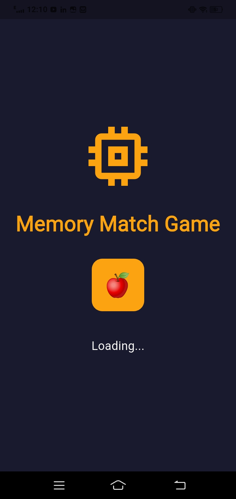
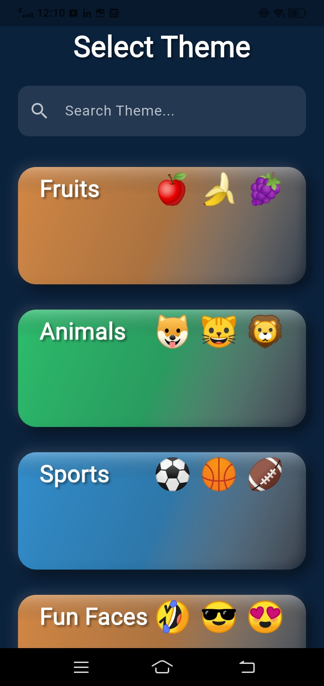
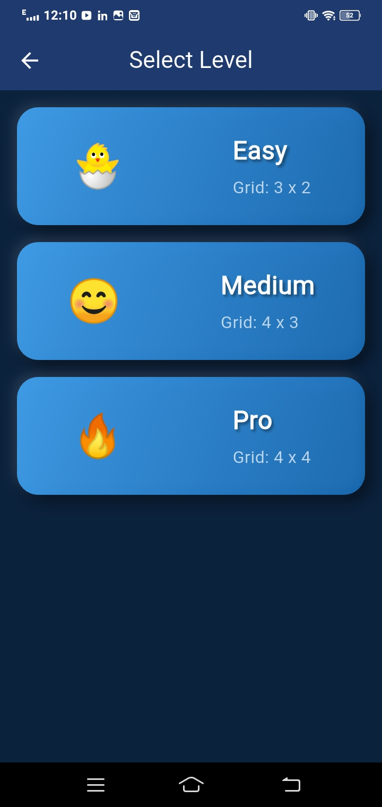
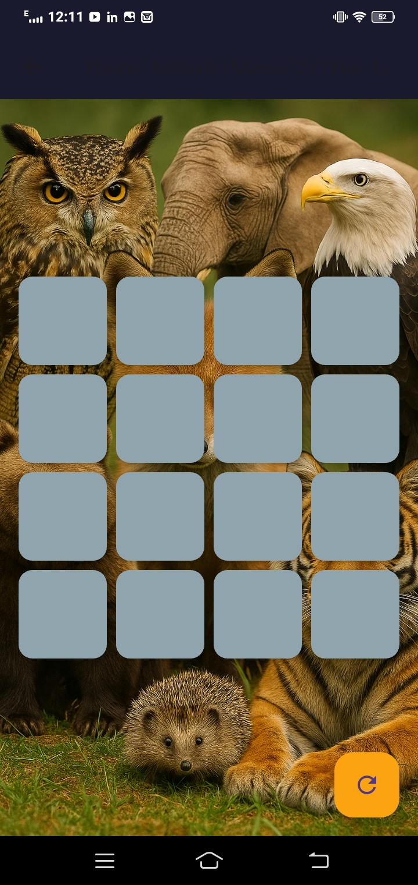
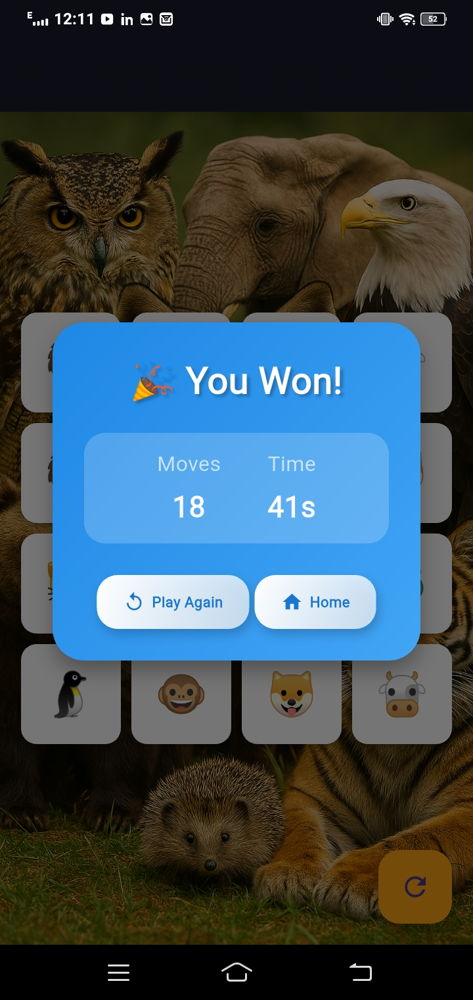

# Memory Merge Game (Flutter)

🎮 **Memory Merge** is a modern, multi-level memory matching game built with **Flutter** and **Dart**. Designed with polished UI, smooth animations, and engaging sound effects, this game offers a premium mobile gaming experience.

---

## **Table of Contents**
- [Features](#features)
- [Categories & Levels](#categories--levels)
- [UI & UX](#ui--ux)
- [Tech Stack](#tech-stack)
- [Screenshots](#screenshots)
- [How to Run](#how-to-run)
- [License](#license)

---

## **Features**
- Multiple difficulty levels: **Easy, Medium, Pro**.
- **10–12 unique game categories** differentiated by background color and theme.
- **Win dialog** with congratulatory animation and sound effects when a level is completed.
- Smooth, premium, and modern UI design.
- Responsive layout for multiple device sizes.
- Score tracking and level progression.
- Polished card animations and interactive UI elements.

---

## **Categories & Levels**
| Category | Levels |
|----------|--------|
| Category 1 | Easy / Medium / Pro |
| Category 2 | Easy / Medium / Pro |
| Category 3 | Easy / Medium / Pro |
| Category 4 | Easy / Medium / Pro |
| Category 5 | Easy / Medium / Pro |
| Category 6 | Easy / Medium / Pro |
| Category 7 | Easy / Medium / Pro |
| Category 8 | Easy / Medium / Pro |
| Category 9 | Easy / Medium / Pro |
| Category 10 | Easy / Medium / Pro |
*(Additional categories up to 12 can be added as implemented)*

Each category has **three levels**, providing increasing difficulty to challenge memory and attention.

---

## **UI & UX**
- Premium dark-themed interface.
- Smooth animations and polished transitions.
- Interactive card flipping with responsive touch gestures.
- Congratulatory sound and animations on level completion.
- Modern design inspired by Material Guidelines.

---

## **Tech Stack**
- **Framework:** Flutter  
- **Language:** Dart  
- **State Management:** Provider  
- **UI:** Custom Material Widgets, Animations, Gradients  
- **Audio:** Flutter Sound / Audio Player  
- **Persistence:** Local storage for scores and game progress

---

## **Screenshots**






> Replace the above image paths with the correct paths in your `assets/images` folder.

---

## **How to Run**
1. Clone the repository:

```bash
git clone https://github.com/<your-username>/memory_merge_flutter_game.git
